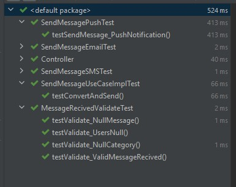

# Send Message Application
This is a Test Project
Here specifications: <a href="BackEndNotificationAPIs_GS.pdf"> Here </a> </br> 
* Java11
* Spring Boot
* Mockito / Junit (Unit Tests)
* Hexagonal Architecture
* Design Patter Strategy used for select the notification type
* Controller Advice
* MongoDB (Mock and Logs)

```
Before starting the application, make sure you have a mongo DB instance running.

When starting the application it will upload the mock to mongo in a "User" table, the Logs are saved by sent message.
One for each user found.

Here a curl for test (Postman/Insomnia):

curl --location --request POST 'http://localhost:8080/send/message' \
--header 'Content-Type: application/json' \
--data-raw '{
    "message":"teste",
    "category":"finance"
}'

```
All classes have been tested. </br>
 </br>